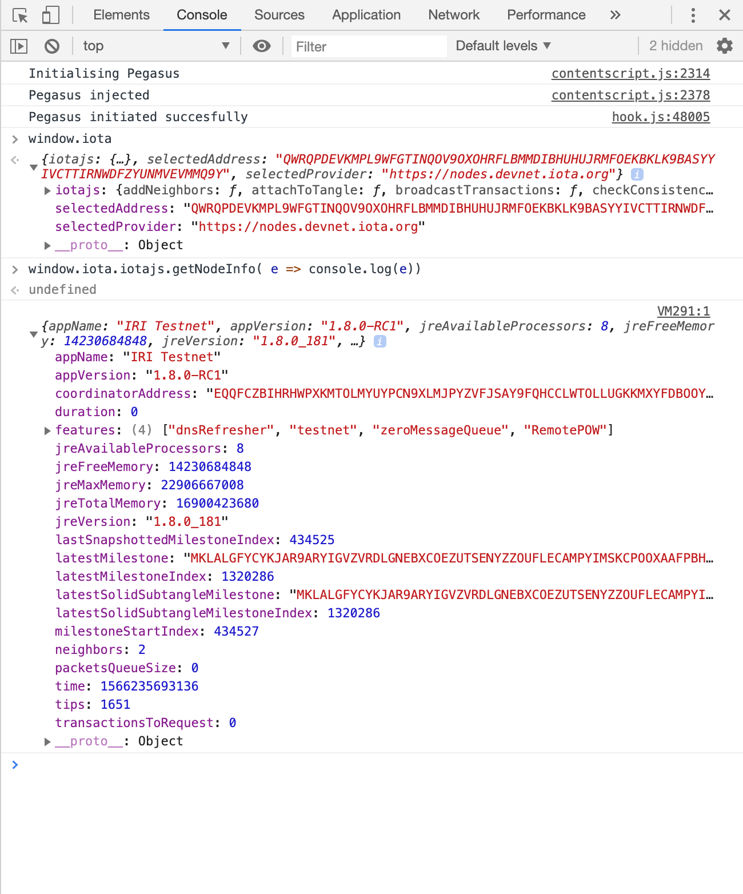
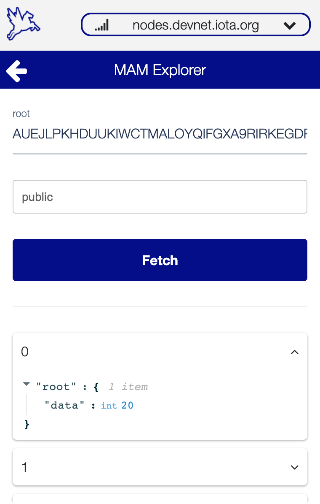

# PEGASUS
 Pegasus is a chrome extension that implements a wallet for the IOTA cryptocurrency. In addition, Pegasus injects the iotajs library allowing developers to interact with IOTA Tangle without paying attention on how to keep the seed safe.


### Installing

```
git clone https://github.com/allemanfredi/PEGASUS.git
```

```
cd PEGASUS
```

```
yarn install
lerna bootstrap
```

```
yarn build
```

If you want to build only the popup:

```
yarn build:popup
```

if you want to build background, contentScript and lib

```
yarn build:core
```


After having built the application, it needs to be loaded on chrome.

## How to install Chrome extensions manually

* Go to chrome://extensions/ and check the box for Developer mode in the top right.
* Click the Load unpacked extension button and select the build folder for your extension to install it.

## How the seed is stored?
An user during the initialization phase will have to enter a password that will be used as a key to encrypt the seed. Of this password the hash will be saved in the localStorage in order to use it during login. The plain text of the password (encryption key) will be saved in a variable within the background script. After 15 minutes of inactivity, the wallet will delete this variable so that the key has not been saved anywhere. In this way the seed encryption key is saved only in the user's mind and in a variable when using the wallet.


## IOTAjs injection.


```js
if (window.iota) {
    const iotajs = window.iota.iotajs;
    const selectedAddress = window.iota.selectedAddress
    
    const transfers = [{
        address: 'address here',
        value: 10, 
        tag: '', // optional tag of `0-27` trytes
        message: '' // optional message in trytes
    }];

    iotajs.prepareTransfers(transfers , (bundle,err) => {
        if (!err){
            console.log(bundle);
        }
    });
}
```

## List of Supported injected functions

 * .addNeighbors(uris, callback)
 * .attachToTangle(trunkTransaction, branchTransaction, minWeightMagnitude, trytes, callback)
 * .broadcastBundle(tailTransactionHash, callback)
 * .broadcastTransactions(trytes, callback)
 * .checkConsistency(transactions, [options], callback)
 * .getNodeInfo(callback)
 * .prepareTransfers(seed, transfers, [options], callback)
 * .findTransactionObjects(query, callback)
 * .findTransactions(query, callback)
 * .getAccountData(options, callback)
 * .getBalances(addresses, threshold, callback)
 * .getBundle(tailTransactionHash, callback)
 * .getInclusionStates(transactions, tips, callback)
 * .getInputs(seed, [options], callback)
 * .getLatestInclusion(transactions, tips, callback)
 * .getNeighbors(callback)
 * .getNewAddress(seed, [options], callback)
 * .getNodeInfo(callback)
 * .getTips(callback)
 * .getTransactionObjects(hashes, callback)
 * .getTransactionsToApprove(depth, [reference], callback)
 * .getTrytes(hashes, callback)
 * .isPromotable(tail, callback)
 * .prepareTransfers(transfers, [options], callback)
 * .promoteTransaction(tail, depth, minWeightMagnitude, transfer, [options], callback)
 * .removeNeighbors(uris, callback)
 * .replayBundle(tail, depth, minWeightMagnitude, callback)
 * .sendTrytes(trytes, depth, minWeightMagnitude, [reference], callback)
 * .storeAndBroadcast(trytes, callback)
 * .storeTransactions(trytes, callback)
 * .traverseBundle(trunkTransaction, [bundle], callback)
 * .generateAddress(seed, index, [security], [checksum] , callback)

## Some screenshots
### Iotajs injection


### Mam explorer


